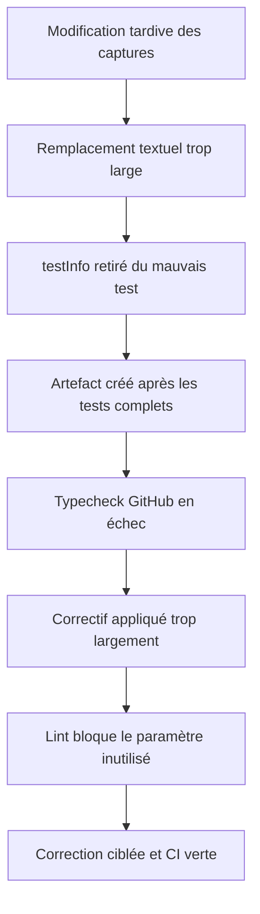

# ActiCiv postmortem de la phase 1

**Période analysée :** 15–16 septembre 2026\
**Périmètre :** fondations techniques du MVP\
**Statut final :** phase 1 clôturée et validée\
**Auteur du bilan :** équipe projet ActiCiv

## Synthèse

La phase 1 a atteint son objectif : construire un socle reproductible, strictement limité aux fondations, pour les applications Citizen et Pro. Le monorepo, le backend interne partagé, le design system, la configuration Supabase DEV, les tests et la CI sont opérationnels.

La clôture a demandé une boucle supplémentaire après la livraison initiale. Une modification effectuée après la dernière validation locale a retiré le paramètre Playwright `testInfo` du test qui l’utilisait. L’archive livrée ne correspondait donc plus exactement à l’état testé. Le contrôle TypeScript de GitHub Actions a détecté le défaut avant les étapes de build et d’E2E. Le premier correctif appliqué localement a ajouté `testInfo` à trop de tests, ce que le lint a ensuite bloqué. La correction finale limite `testInfo` au seul test de capture.

L’incident n’a touché ni des données ni un environnement utilisateur. Son impact a été un retard de validation, plusieurs manipulations manuelles pour Patrick et une perte de confiance évitable dans le processus de livraison. La cause principale est un défaut de discipline de release : l’artefact a été modifié après les tests complets, sans refaire toute la chaîne de validation sur les octets effectivement livrés.

La phase est désormais validée par les contrôles locaux, les deux jobs GitHub Actions, Supabase local et VoiceOver sur les deux surfaces. TalkBack reste une vérification complémentaire différée jusqu’à disponibilité d’un environnement Android compatible.

## Objectifs et résultats

| Objectif | Résultat final |
| --- | --- |
| Monorepo pnpm | Validé |
| Applications Next.js Citizen et Pro | Validées |
| Backend métier partagé strictement interne | Validé |
| TypeScript strict et frontières d’import | Validés |
| Design tokens et marque centralisée | Validés |
| Primitives accessibles utilisées réellement | Validées |
| Supabase DEV local, reset et seed | Validés sur le Mac de Patrick |
| GitHub Actions | Jobs `app` et `database-foundation` validés |
| Tests unitaires | 6 sur 6 réussis |
| Tests Playwright | 12 sur 12 réussis sans retry |
| Accessibilité axe | Aucun défaut détecté sur le périmètre testé |
| VoiceOver Safari | Validé pour Citizen et Pro |
| TalkBack | Différé, faute d’environnement Android disponible |
| PostGIS | Non introduit, conformément à la décision |
| Phase 2 | Non commencée |

## Ce qui a bien fonctionné

### Les garde-fous ont détecté les vrais défauts

TypeScript, ESLint et GitHub Actions ont chacun arrêté un problème réel. La CI a refusé le code contenant une référence non déclarée. ESLint a ensuite refusé un paramètre ajouté au mauvais test. Aucun contrôle n’a été désactivé, aucun avertissement n’a été toléré artificiellement et aucun test n’a été affaibli pour obtenir un résultat vert.

### Le périmètre est resté maîtrisé

Aucun modèle métier prématuré, aucune policy RLS factice, aucune extension PostGIS, aucun workflow de signalement et aucune infrastructure de production n’ont été ajoutés. Les ambiguïtés métier ont été consignées sans être tranchées dans le code.

### L’architecture crée des frontières utiles

`packages/backend` reste un module du monolithe sans processus autonome. Les règles d’import empêchent les packages publics d’accéder au backend ou à Supabase. La marque et les tokens sont centralisés. Le socle permet de faire évoluer les deux applications sans dupliquer la logique serveur.

### Les validations ont été réelles et différenciées

Le rapport a distingué les tests exécutés des contrôles impossibles dans l’environnement initial. Supabase n’a pas été déclaré fonctionnel avant son exécution réelle avec Docker. Le navigateur temporaire utilisé localement est resté hors des dépendances du projet, tandis que GitHub Actions a utilisé l’installation Playwright standard. VoiceOver a été vérifié manuellement au lieu d’être déduit du seul scan axe.

### Patrick a remonté les échecs complets

Les journaux transmis ont permis de distinguer rapidement une incompatibilité de runtime, une erreur TypeScript et un avertissement ESLint. Cette remontée factuelle a évité les corrections spéculatives.

## Incidents et difficultés

### Incident principal : archive différente de l’état validé

**Symptôme :** GitHub Actions échoue pendant `pnpm typecheck` avec `TS2304: Cannot find name 'testInfo'`.

**Chronologie :**

1. Le test de capture utilisait `testInfo.outputPath`.
2. Une modification large destinée à retirer un paramètre inutilisé d’un autre test a aussi retiré `testInfo` du premier test.
3. Le lint local final avait été exécuté, mais l’artefact final n’a pas subi à nouveau la chaîne complète sur son contenu exact.
4. L’archive contenant la régression a été livrée.
5. GitHub Actions a détecté l’erreur TypeScript.
6. Un remplacement trop large a ensuite ajouté `testInfo` à un second test qui ne l’utilisait pas.
7. ESLint a bloqué cet état avec `no-unused-vars`.
8. La signature finale a été corrigée précisément : `testInfo` uniquement dans le test de capture.

**Cause immédiate :** remplacement textuel insuffisamment ciblé dans un fichier comportant plusieurs signatures similaires.

**Cause racine :** absence d’un gel de l’artefact avant validation. Les tests et l’archive n’étaient pas liés par une étape unique garantissant que les fichiers livrés étaient exactement ceux qui venaient d’être testés.

**Facteurs contributifs :**

- ajout tardif de captures d’écran après une première campagne E2E réussie ;
- plusieurs modifications automatisées successives du même fichier ;
- exécution de contrôles partiels après certaines modifications ;
- création de l’archive avant validation distante ;
- rapport initial trop confiant sur l’état livré.

**Impact :** deux runs de CI échoués, corrections manuelles supplémentaires et retard de clôture. Aucun impact fonctionnel en production, puisque rien n’était déployé.

### Runtime Node différent entre les terminaux

**Symptôme :** les nouveaux terminaux reprenaient Node 20.20.1, alors que le projet exige Node 24. pnpm échouait sur `node:sqlite` avant d’exécuter les scripts.

**Cause :** `nvm use 24` ne vaut que pour le terminal courant et Node 24 n’était pas encore l’alias par défaut.

**Correction :** utilisation de `nvm use 24` dans chaque terminal et configuration de `nvm alias default 24`.

**Enseignement :** `.nvmrc` documente la version mais ne force pas automatiquement son activation dans tous les shells. La procédure de démarrage doit le préciser dès le premier lancement multi-terminal.

### Versions initiales incompatibles dans la chaîne d’outillage

La résolution initiale avait sélectionné TypeScript 7 et ESLint 10, incompatibles avec certains plugins installés. `pnpm peers check` a rendu le conflit visible. TypeScript 5.9.3 et ESLint 9 ont été retenus et figés dans le lockfile.

La dépréciation signalée pour ESLint 9.39.5 reste une dette visible. Elle sera réévaluée avant PROD, lorsque l’écosystème utilisé déclarera une compatibilité cohérente. La mise à niveau ne devra pas contourner les peer dependencies.

### Supabase non exécutable dans l’environnement initial

L’environnement de construction ne disposait ni de Docker ni de Podman. La configuration a pu être créée, mais `db:start`, le reset et le seed ne pouvaient pas être validés localement. Ces contrôles ont été laissés non vérifiés jusqu’à leur exécution réelle sur le Mac de Patrick et dans GitHub Actions.

Ce comportement était correct : aucun mock n’a été présenté comme preuve de fonctionnement de Supabase.

### Téléchargement Playwright indisponible dans l’environnement initial

Le CDN Playwright expirait après 30 secondes. Un Chromium provenant de `@sparticuz/chromium` a été installé dans un dossier QA temporaire hors monorepo. Il a servi uniquement à exécuter localement les 12 tests. La CI a conservé le navigateur Playwright standard.

Le premier lancement de ce Chromium était instable avec `--single-process`. Le retrait de cet argument a permis l’exécution sans retry. Cette solution de diagnostic ne fait pas partie du produit.

## Analyse des causes

La défaillance technique était simple. Le problème de processus était plus important : le dernier état testé n’était pas le dernier état livré. Tant que cette relation n’est pas garantie mécaniquement, un rapport peut décrire correctement des commandes tout en attribuant leurs résultats au mauvais contenu.

## Ce qui aurait dû être mieux fait

- Lancer `format:check`, `lint`, `typecheck`, tests unitaires, builds et E2E après toute modification, même documentaire lorsqu’elle touche la constitution de l’archive.
- Créer l’archive uniquement depuis un commit propre ayant passé tous les contrôles.
- Comparer le SHA du commit validé avec le SHA livré et celui exécuté dans GitHub Actions.
- Éviter les remplacements globaux lorsqu’un fichier contient plusieurs motifs similaires ; appliquer un patch ciblé puis inspecter le diff.
- Ne pas annoncer un résultat final avant l’exécution de la CI distante lorsque celle-ci fait partie des critères d’acceptation.
- Indiquer dès le départ que `nvm use` s’applique à chaque nouveau terminal ou configurer l’alias Node par défaut avant les tests multi-processus.
- Préparer une fiche de validation manuelle d’accessibilité plus courte, orientée résultats, dès la création des écrans.

## Actions préventives obligatoires

| Action | Moment | Preuve attendue |
| --- | --- | --- |
| Ajouter un script racine `verify` qui enchaîne format check, lint, typecheck, unitaires et builds | Avant tout code de phase 2 | Commande unique verte |
| Ajouter un script `verify:full` incluant Playwright et audit | Avant la première livraison de phase 2 | Suite complète verte sans retry |
| Livrer depuis un commit propre et identifié | Chaque fin de phase | `git status` vide et SHA inscrit au rapport |
| Créer l’archive depuis `git archive` ou une liste issue du commit | Chaque livraison | Aucun fichier non commité ou postérieur aux tests |
| Exécuter la CI sur le même SHA avant de déclarer la phase terminée | Chaque fin de phase | URL du run et deux jobs verts |
| Interdire les modifications de code après la validation finale ; toute modification invalide les résultats précédents | Immédiat | Nouvelle exécution complète |
| Inspecter systématiquement `git diff --check` et le diff du fichier modifié | Chaque correctif | Aucun défaut de diff |
| Documenter `nvm use` ou automatiser l’activation locale de Node 24 | Immédiat | Nouveaux terminaux en Node 24 |
| Maintenir la dette ESLint dans le suivi technique | Avant PROD | Décision documentée et peer dependencies propres |
| Ajouter les tests RLS, Auth et transactions seulement avec le modèle de phase 2 | Phase 2 | Tests sur Supabase réel, sans mocks équivalents |
| Effectuer TalkBack dès qu’un appareil compatible existe | Dès disponibilité | Checklist datée Android/Chrome/TalkBack |

## Décisions conservées

- `packages/backend` reste un package interne au monolithe.
- PostGIS reste à confirmer lors de la modélisation réelle des territoires et du routage.
- Les ambiguïtés métier restent ouvertes jusqu’à leur phase.
- `@sparticuz/chromium` reste un outil temporaire extérieur au projet.
- La chaîne ESLint actuelle reste figée tant qu’une migration compatible n’est pas préparée et testée.
- Les tests de sécurité de la base devront utiliser une instance Supabase réelle.

## État final de la qualité

| Contrôle | État final |
| --- | --- |
| Installation figée | Validée |
| Formatage et lint | Validés |
| TypeScript strict | Validé après correction `testInfo` |
| Tests unitaires | 6 sur 6 |
| Builds Citizen et Pro | Validés |
| Playwright | 12 sur 12, sans retry |
| axe | Aucun défaut détecté sur le périmètre |
| Supabase start/reset/seed/status | Validés localement et via le job dédié |
| GitHub Actions | Jobs `app` et `database-foundation` verts |
| VoiceOver Safari | Validé sur Citizen et Pro |
| TalkBack | Différé |
| Vulnérabilités connues signalées par `pnpm audit` | Aucune au moment du contrôle |

## Conclusion et condition de passage

La phase 1 est clôturée. Elle fournit un socle sain et, surtout, une leçon de processus concrète : un résultat de test n’est valable que pour l’état exact du code exécuté. La CI a correctement empêché la validation d’un artefact défectueux, mais elle est intervenue après la remise initiale.

Avant d’écrire le premier code de phase 2, la préparation devra intégrer le script de vérification unique, la livraison liée à un SHA propre et les arbitrages métier déjà consignés. Ces mesures sont des conditions de démarrage de la phase suivante, pas une extension fonctionnelle de la phase 1.
